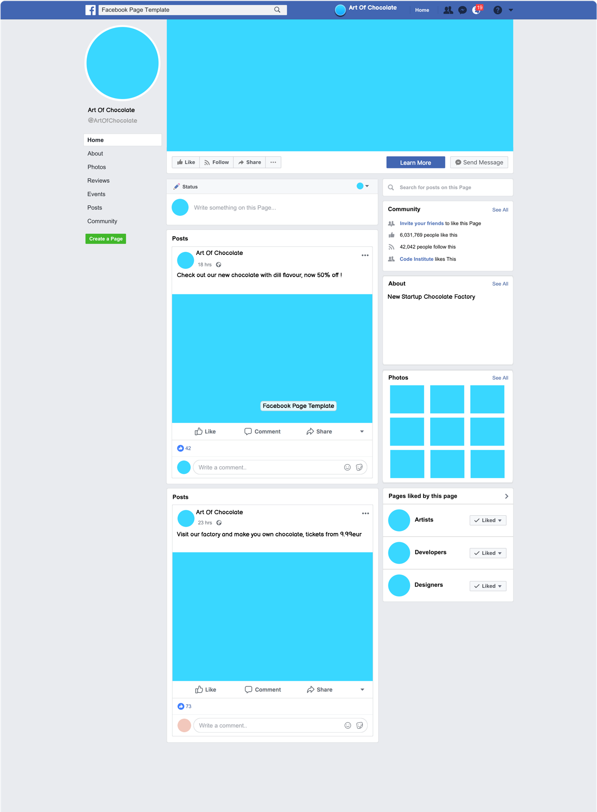
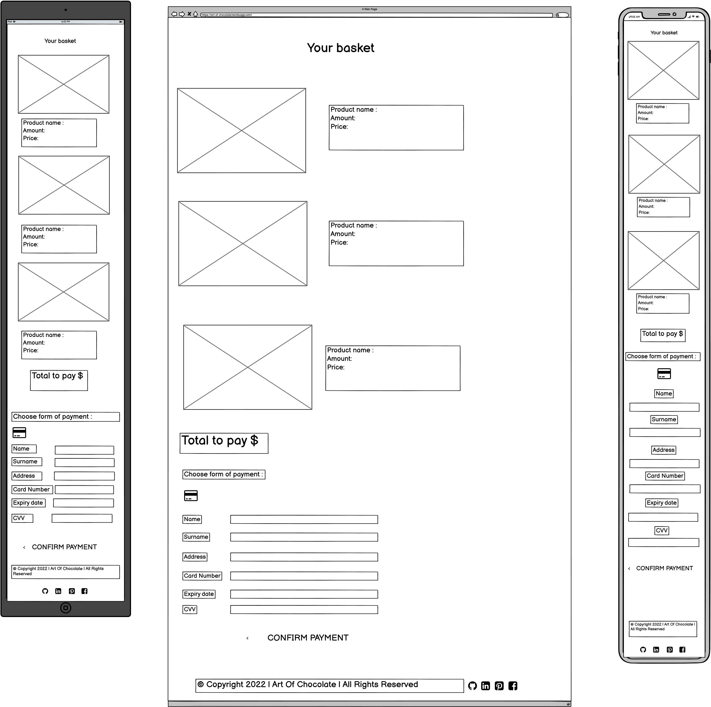
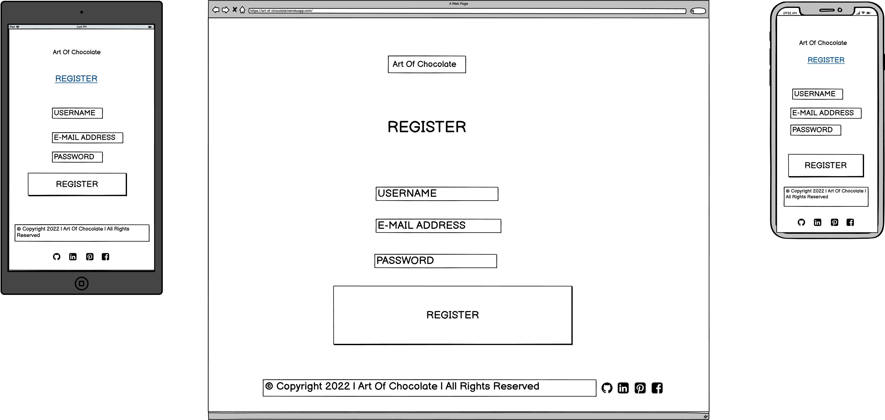
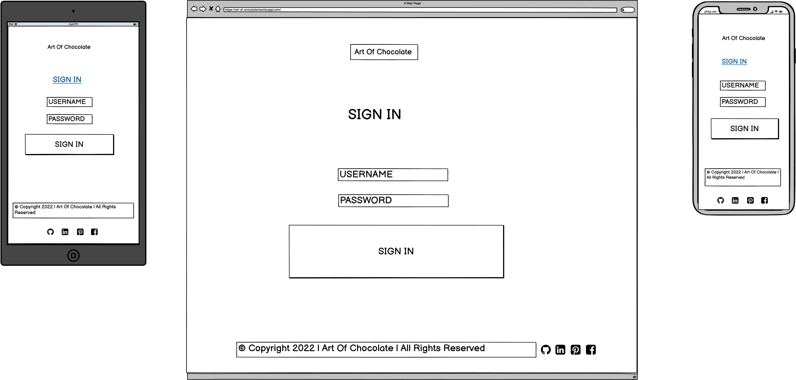
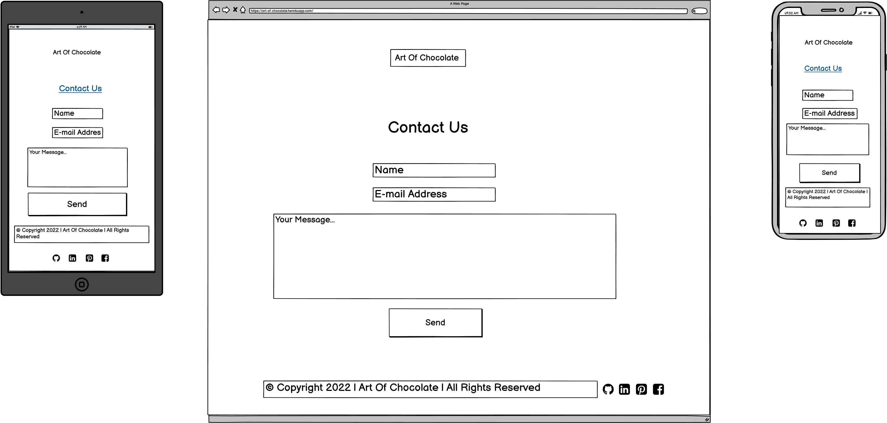
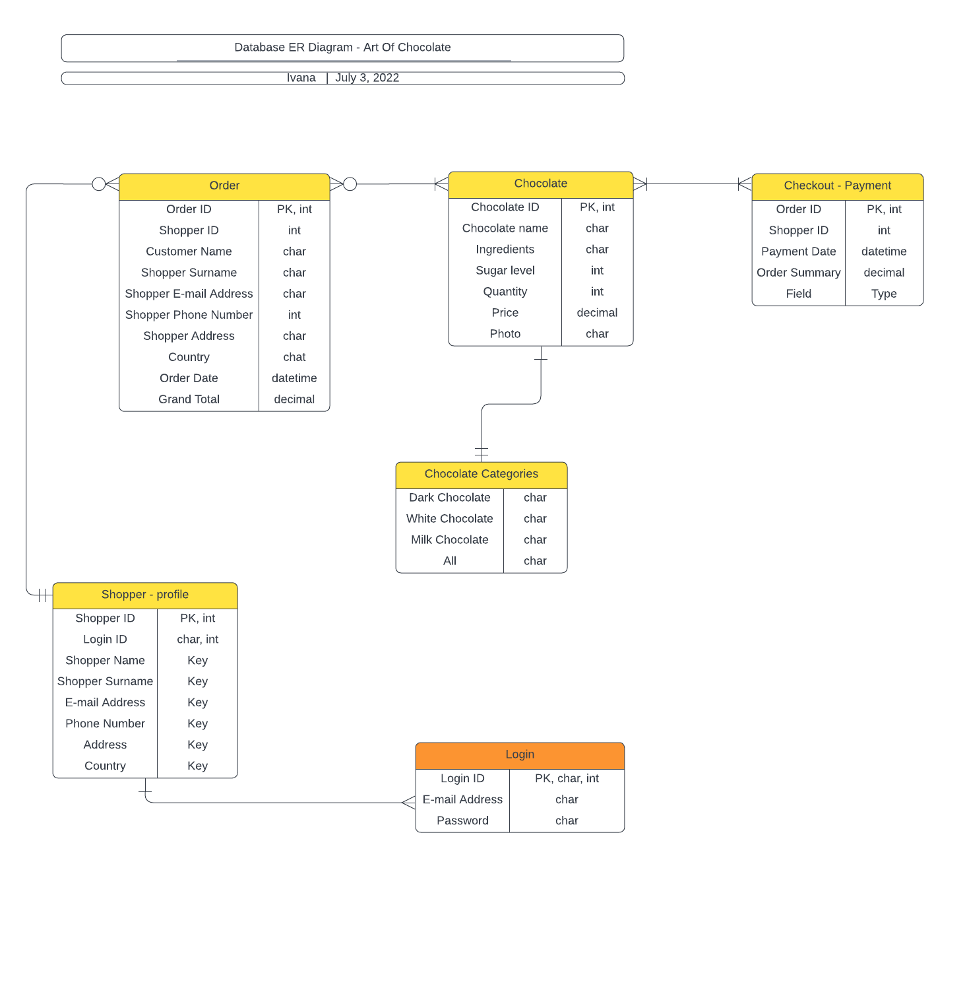

# Art Of Chocolate
Art Of Chocolate is an E-commerce Website that allows people to buy chocolate with unusual tastes.
It is loved by many pastry chefs around the world.
s a startup Company we will wait for few months before deciding on the best place to show off our product.
- People - Concentration of the business is on personas who like new things, who are not afraid to risk and who are adventurous. People all over the World as Website gives shipping option.

You can access live page to Art Of Chocolate by clicking [here](https://art-of-chocolate.herokuapp.com/).

# Business Model

Art Of Chocolate is a B2C business supporting the end consumer. The site gives User the option to create an account, look for desired product and purchase it by card and sign-up for a Newsletter. Full CRUD functionality is available for superusers only.

# Marketing Strategy

7 P's Marketing Strategy was used throughout the whole process of this project : 

- Product - Chocolate used is made from the finest cocoa solids and cocoa butter and as such will be marked as a "pure ingredients and high quality product".
- Promotion - Lot of promotions will be organised through Newsletters, Social Media, online events and other.
- Price - Price of all products is the same but the Company will make new strategies and planning for Newsletter and Social Media Campaigns. There will always be discounts there so we can engage more people to buy the product.
- Place - As a startup Company we will wait for few months before deciding on the best place to show off our product.
- People - People in our team will grow how the team grows, making sure customers are happy and that they are starting to promote the product free by "word of mouth".
- Process - All processes and materials used are sustainable and this will be presented to the customer.
- Physical Evidence - Company owns a factory where all chocolates are produced but main point of sale will be our Website.

Part of a Business Strategy is also a [Facebook](https://www.facebook.com/) mockup page, made with [Balsamiq](https://balsamiq.com/):

# User Experience
## User Stories

- User Stories are made with an Agile approach. 

  - As a User I want to be able to create an account.
  - As a User I want to be able to search for the products.
  - As a User I want to be able to add product to the basket.
  - As a User I want to be able to purchase product with credit card.
  - As a User I want to be able to signup for a Newsletter.
  - As a User I want to be able to see Social Media links on the Website.

Future development : 

## Features
- Navigation and Social Media Icons etc

- Navigation

- Social Media Icons

- Footer

## Goals

### Visitor goals

Target Audience are all the people who love chocolate. Business has a great potential to grow into B2B, where businesses where chocolate is neccesity and main ingreadient like bakeries and coffee shops will be able to purchase high quality products.

- To have easy navigation and clear message.
- To see the insight of the Company and understand quality of the product.
- For the page to be relevant to what the visitor searched online.
- For the product to be of a good quality, as presented.
- To be able to make purchase easy and quickly.
- To be able to see Social Media links for further Information and stories about the Company.

### User Goals

As a user I would like to:

- Be able
- Be able 
- Be able 
- Be able

## Design Choices

Font choices

I have decided to use [Google Fonts](https://fonts.google.com/). 
 - Font Style used: Manrope 300
 - This font complements Art Of Chocolate WebShop reallz well.
 - I have included example of the style below: 
  

Icons

- Social Media Icons [Facebook](https://www.facebook.com/), [Instagram](https://www.instagram.com/) and [Pinterest](https://www.pinterest.ie/) 
- [Fontawesome](https://fontawesome.com/) was used to add social media icons.

 
## Color scheme and styling

I have decided to use colors

## Wireframes
All wireframes are created with [Balsamiq](https://balsamiq.com/) during the Scope Plane part of the design and planning process for this project.

Main Page

Chocolate Shop

Basket

Register Page

Sign In

Sign Out

Success

Contact Us

## ERD Diagram
ERD Diagram is created with [Lucidchart](https://www.lucidchart.com/pages/) during the Scope Plane part of the design and planning process for this project.

## Testings

To view all testing documentation please refer to 

### Local Deployment

In order to make a local copy of this repository, you can type the following into your IDE Terminal:

- `git clone https://github.com/Ivana505/art-of-chocolate.git` 

Alternatively, if using Gitpod, you can click below to create your own workspace using this repository.

The site was deployed to [Heroku](https://art-of-chocolate.herokuapp.com/) pages using following steps: 
   - Sign up or Login to Heroku 
   - Click on the "NEW APPLICATION" and create an App name and choose your region
   - Click on "Deploy" and choose your deployment method
   - If you are connecting with Github choose your main branch and find your repository
   - Add config vars PORT = 8000 and buildpacks python and nodejs
   - Click on deploy manually or automatically
   - The project has now been deployed
   - When deployed click on view
   - If you click on settings on the main menu bar you will find your Heroku git URL

    To install the required packages for this application, type the following: pip3 install -r requirements.txt

NEED TO ADD REQUIREMENTS

The live site can be previewed [here](https://art-of-chocolate.herokuapp.com/).

  # Languages and technologies used
- [Python](https://www.python.org/) - used for core programming language and logic
- [Github](https://github.com/) - used for securely storing the code online
- [Git](https://git-scm.com/) - used for version control
- [Gitpod](https://www.gitpod.io/) - used for online cloud IDE and development
- [Heroku](https://heroku.com/) - platform used to deploy game to cloud online
- [Django Secret Key Generator](https://miniwebtool.com/django-secret-key-generator/) - for generating Secret Key
- [Font Awesome](https://fontawesome.com/) - for Icons on the page
- [Freeformatter](https://www.freeformatter.com/) - used to format and beautify HTML and CSS code
- [PEP8 validator](http://pep8online.com/) - used to validate Python code
- [Coloors](https://coolors.co/) - to create color scheme for the UX section

## Credits and Acknowledgements

  ADD CREDITS

  Image and Social Media sources:
- [YouTube channel ](https://www.youtube.com/)
- [Pixabay](https://pixabay.com/)

  Other sources
 
 - [YouTube channel CodingEx](https://www.youtube.com/watch?v=HsDSXh26yKc) - Helped me with creating chocolate_image.html page.
 - [YouTube channel Dennis Ivy Django Ecommerce series](https://www.youtube.com/watch?v=_ELCMngbM0E) - Used as a boilerplate for the project,.
 - [Smartinsights](https://www.smartinsights.com/marketing-planning/marketing-models/how-to-use-the-7ps-marketing-mix/) - Insight of 7 P's in Marketing.
 - [Emarsys](https://emarsys.com/learn/blog/what-is-b2c-marketing/) - More Information about B2C.
 - [Assemblo](https://assemblo.com/guides/what-are-the-7-ps-of-marketing/)- Insight of 7 P's in Marketing.
 - [Youtube channel Easy WebCode](https://www.youtube.com/watch?v=g55EQkDGdg4) - details in creating Newsletter.
 - [Javascripter](http://www.javascripter.net/faq/validati.htm) - For nesletter notification setup.
 - [Youtube channel Codepiep](https://www.youtube.com/watch?v=66joNBEyNwE) - Used to set up STRIPE.
 - [Stack Overflow](https://stackoverflow.com/questions/64476542/stripe-error-in-order-to-use-checkout-you-must-set-an-account-or-business-name) - Helped to resolve STRIPE checkout error.
 - [Youtube channel Technology IT](https://www.youtube.com/watch?v=dpU3KY6mQ28) - For adding categories to Django.
 - [Youtube channel Codemy.com](https://www.youtube.com/watch?v=_ph8GF84fX4) - For adding categories to Django.
 - [Django Central](https://djangocentral.com/django-admin-making-model-fields-required/) - For resolving the issue where Django categories showed as objects rather than with their names.
 - [Computerhope.com](https://www.computerhope.com/issues/ch000317.htm) - Used to create go back button.
 - [Pythonstacks](https://www.pythonstacks.com/blog/post/integrating-mailchimp-django/) - For implementing mailchimp.

I want to say thank you to my Mentor Tim for the guidance, tutor support and special thanks to the Code Institute Slack community.

### Content
 - Content was created intentionally for the purpose of this project and this Website.

