# Art Of Chocolate
Art Of Chocolate is an E-commerce Website that allows people to buy chocolate with unusual tastes.
It is loved by many pastry chefs around the world.

Also, our clients are people who like to try new tastes, who are not afraid to risk and who are adventurous. People from all over the World can order our Chocolate as Website gives shipping option worldwide.

Users can browse the shop and view each product, check chocolate categories and use search bar. They can also add products to basket and purchase them by using payment with Stripe (you can find more details in [TESTING.md](TESTING.md)).

This project is made for Code Institute Full-stack development program - Portfolio 5.

You can access live page to Art Of Chocolate by clicking [here](https://art-of-chocolate.onrender.com).

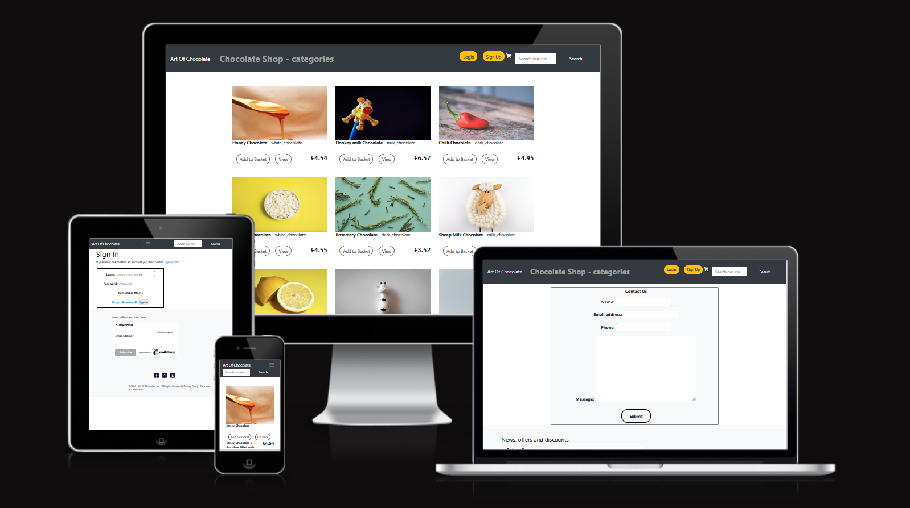

# Table of content:
- [Art Of Chocolate Shop](#art-of-chocolate)
- [Business Model](#business-model)
- [User Experience](#user-experience)
  - [User Stories](#user-stories)
  - [Security Features](#security-features)
      - [User Access](#user-access)
      - [Form Validation](#form-validation)
      - [Data and Env.py file](#data-and-envpy-file)
      - [404 page](#404-page)
  - [Features](#features)
      - [Navigation](#navigation)
      - [Footer](#footer)
      - [Landing page and features for Anonymous and Registered User](#landing-page-and-features-for-anonymous-and-registered-user)
      - [Landing page and features for Superuser](#landing-page-and-features-for-superuser)
      - [Sign in, Sign Up, Logout, Password reset](#sign-in-sign-up-logout-password-reset)
      - [Forms](#forms)
- [Goals](#goals)
  - [Visitor goals](#visitor-goals)
  - [User goals](#user-goals)
  - [Future implementation](#future-implementation)
- [Design Choices](#design-choices)
  - [Font Chcoices](#font-choices)
  - [Icons](#icons)
  - [Color scheme and styling](#color-scheme-and-styling)
- [Wireframes](#wireframes)
- [ERD Diagram](#erd-diagram)
- [Marketing Strategy](#marketing-strategy)
- [SEO](#seo)
  - [Keyword Research](#keyword-research)
  - [Sitemap and robots.txt](#sitemap-and-robotstxt)
  - [Mailchimp](#mailchimp)
- [Testings](#testings)
- [Local Deployment](#local-deployment)
- [Languages and technologies used](#languages-and-technologies-used)
  - [Credits and Acknowledgements](#credits-and-acknowledgements)
  - [Content](#content)

# Business Model
Intention behind creating Art Of Chocolate website is increasing amount of diversity in chocolate tastes. Art Of Chocolate is a B2C business supporting the end consumer. The site gives User option to interact with central dataset, choose and purchase products and process payment with Stripe. Users can sign-up to Art Of Chocolate Newsletter. Full CRUD functionality is implemented.

# User Experience
## User Stories
User Stories were made with an Agile approach, Kanban board. User stories were documented within the Github Project option by using Github issues.

User stories are divided to different types of users and actions:

- Users:
  - Site Users - Anonymous and Registered Users
  - Superuser

- Actions:
  - To do
  - In Progress
  - Done
  - Future Implementation

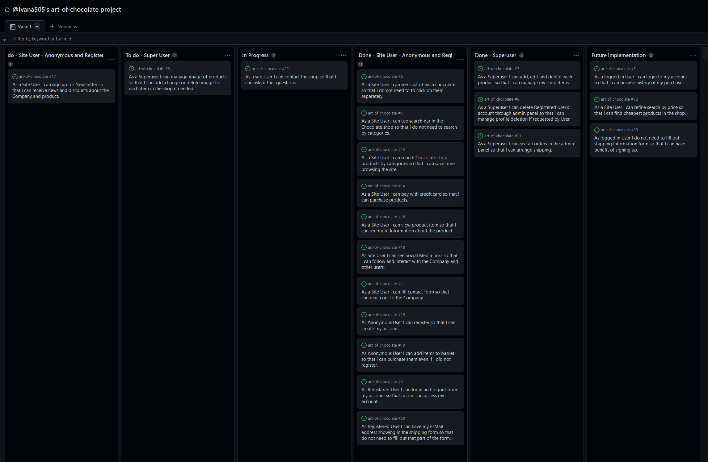

## Security Features
### User Access
Anonymous and Registered Users do not have access to add, edit or delete products. 

- If Anonymous User tries to access add, edit or delete page, user will be transfered to Sign In page.

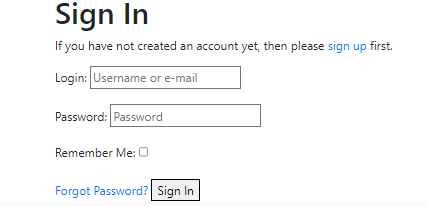

- If Registered User tries to access add, edit or delete page, HttpResponse message generates.

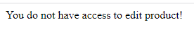

### Form Validation
- Shipping form, Newsletter Mailchimp form and Contact Us form require all input data, they restrict Users to proceed if any of the fields are empty.

### Data and Env.py file
- All data, Secret Keys, API's, Database Urls and E-mail Information were stored within env.py file to secure unwanted access.

### 404 page
- Custom 404 error for the page that does not exist or is unavailable.

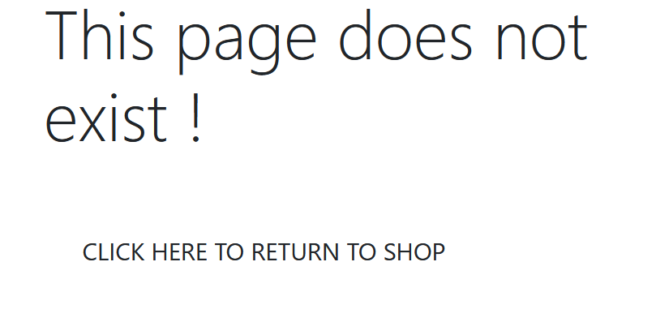

## Features
### Navigation

Navigation is divided into two parts so that it is easier for user to navigate and interact with the page.

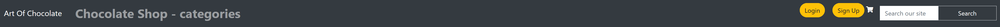

- Shop name and categories are positioned on the left side of the header.

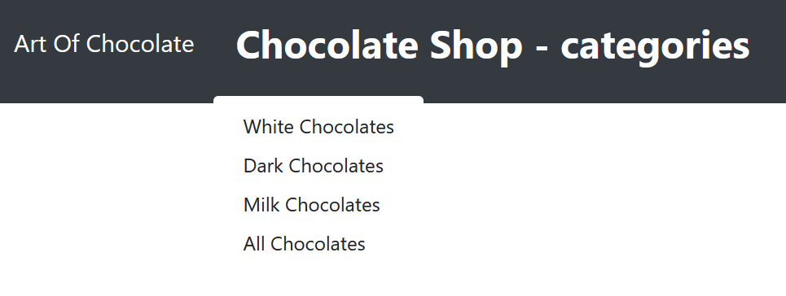

- Login and sign up buttons, basket icon and search bar are on the right side of the header.

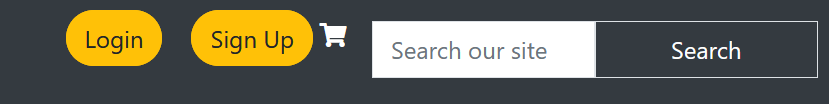

- When User logs in greeting message will appear.

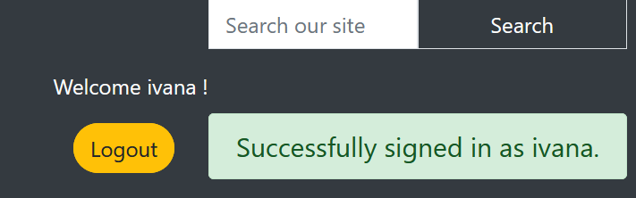

- When User logs out message will appear advising user sign out was successful.

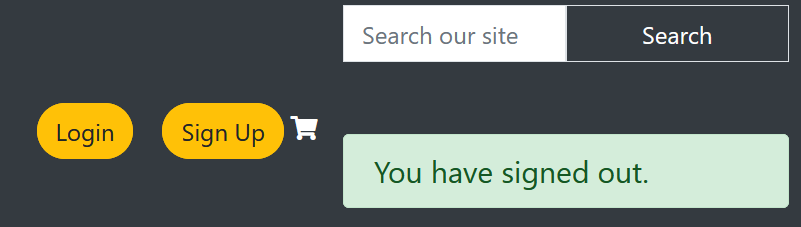

### Footer

Footer includes Mailchimp Newsletter form, Social Media links, owner Information and Contact Us link.

- Newsletter signup offered with mailchimp.

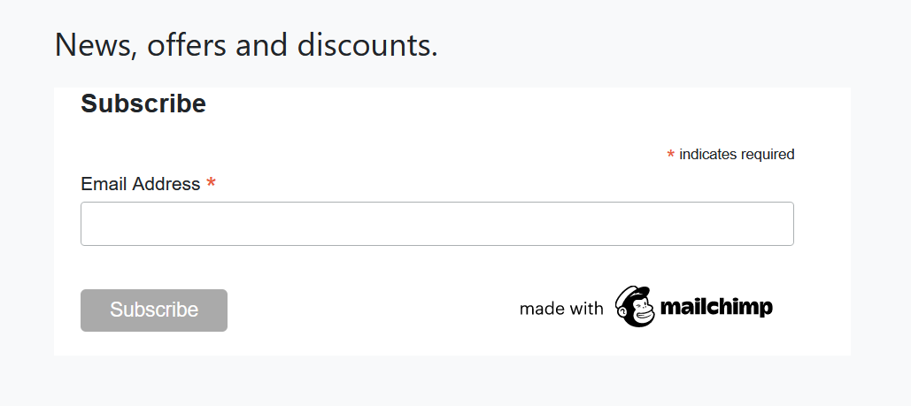

- Social Media Icons for Facebook, Instagram and Pinterest pages.

### Landing page and features for Anonymous and Registered User

- Lnading page is showing chocolate products available in the shop, their prices and type of chocolate.

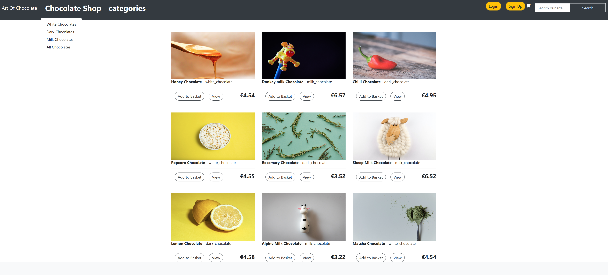

- Chocolate page includes more Information about the chocolate product. It shows product price and type of chocolate. User has option to add product to basket or go back to the main shop page.

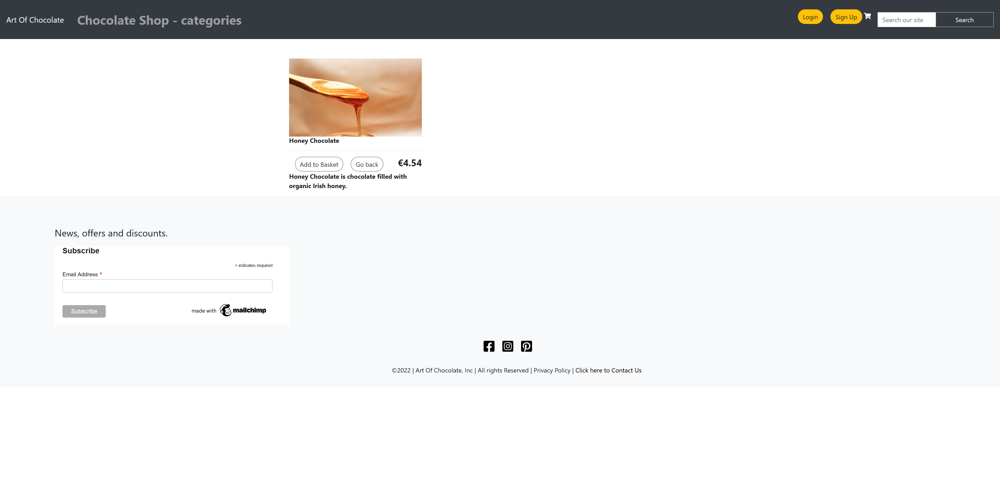

- Basket page with product added to basket and shipping form.

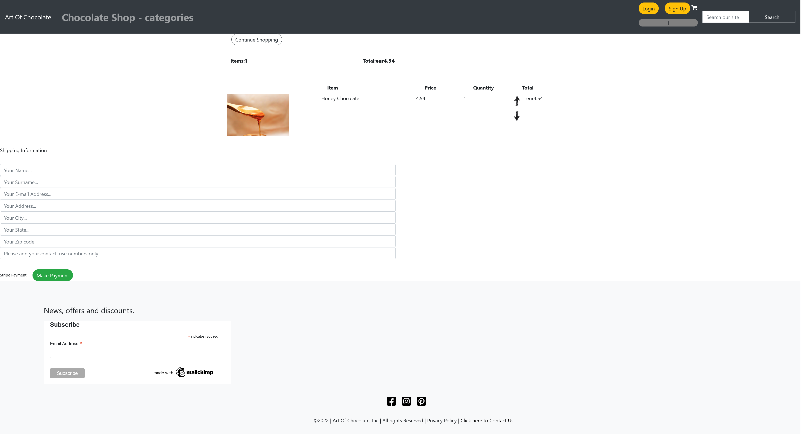

- If all products are removed from the basket, User can still access the page but shipping Information is removed.

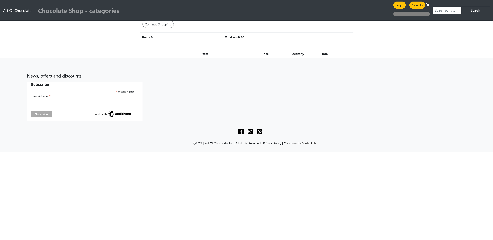

- On the checkout page User can confirm that it is ok to proceed to payment with the total amount noted on the page.

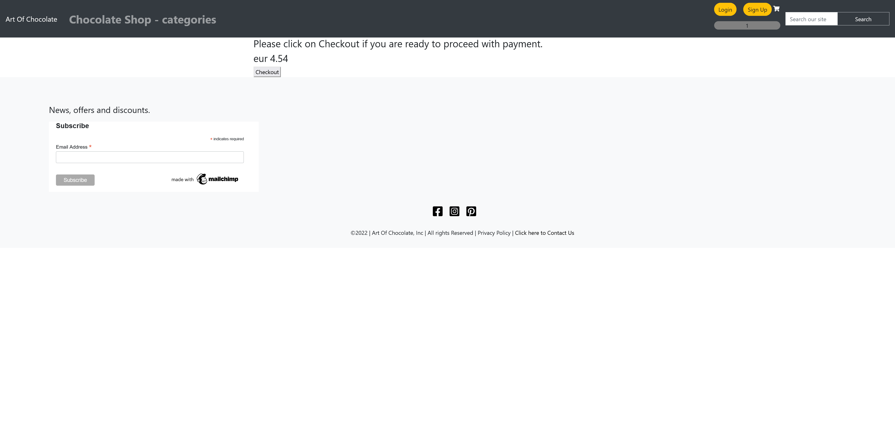

### Landing page and features for Superuser

Superuser has access to add, edit and delete chocolate products.

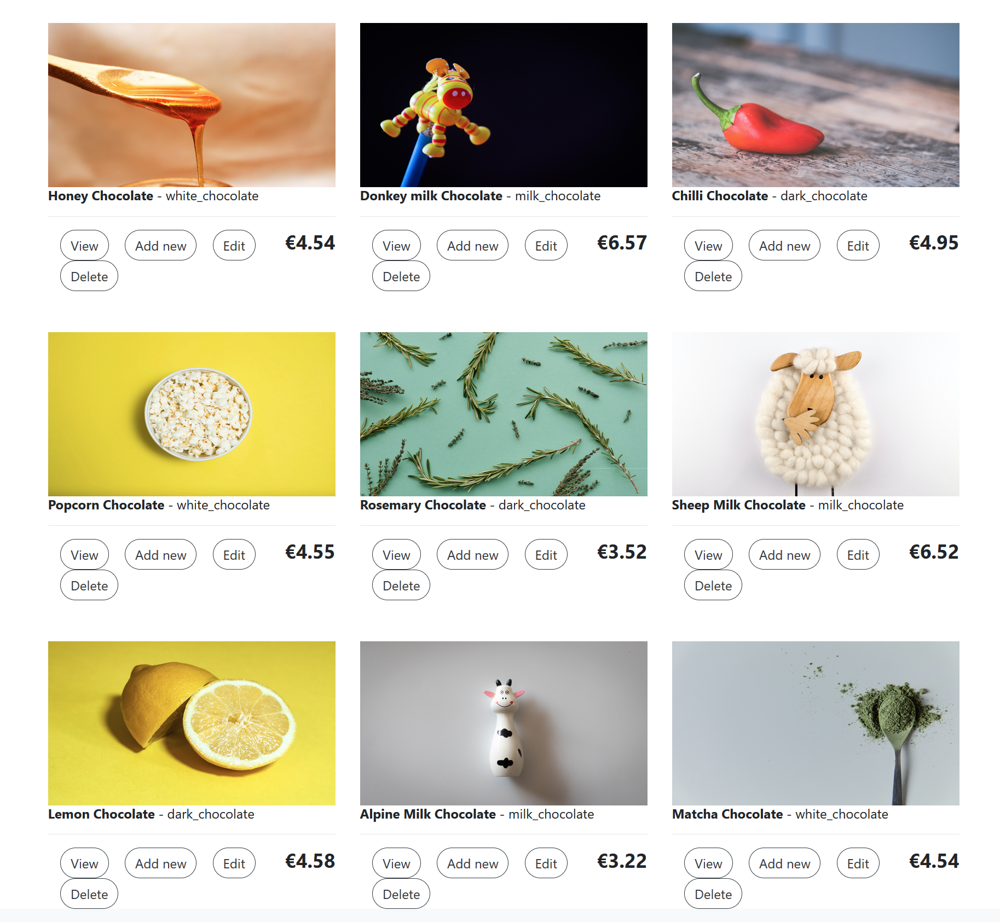

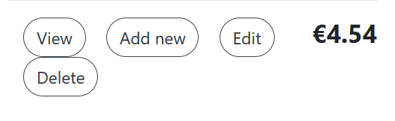

- Add

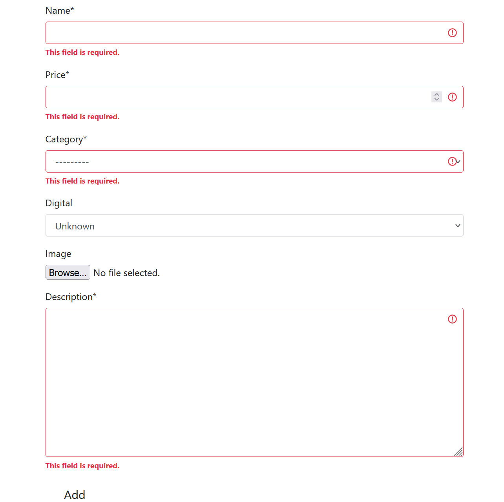

- Edit

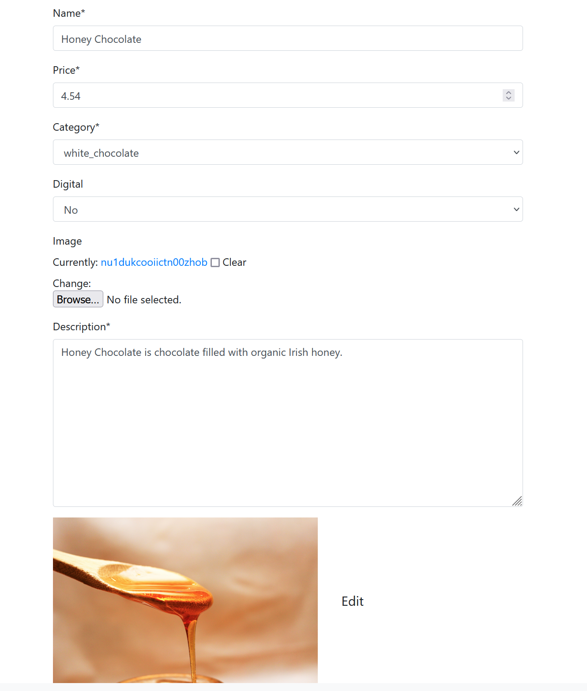

- Delete

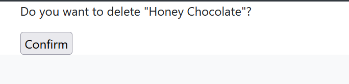

Superuser does not have access to basket and checkout page.

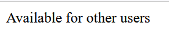

### Sign in, Sign Up, Logout, Password reset

- If User wants to Sign Up for the Account, E-mail verification is mandatory.

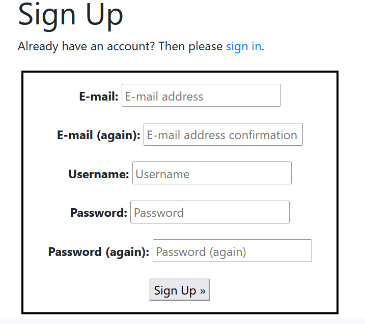

E-mail verification

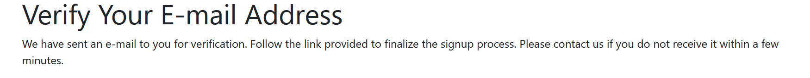

Signing out

User has an option to reset password if required.

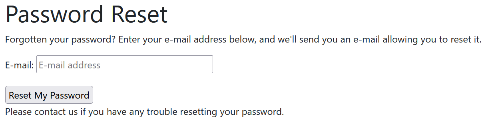

### Forms

Shipping form - can only be submitted if all the fields are filled out correctly. If User is logged in, E-mail Address from the Account will automatically pull into the form.

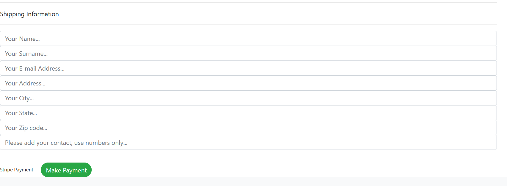

Contact form - all fields must be filled out for the form to be sent.

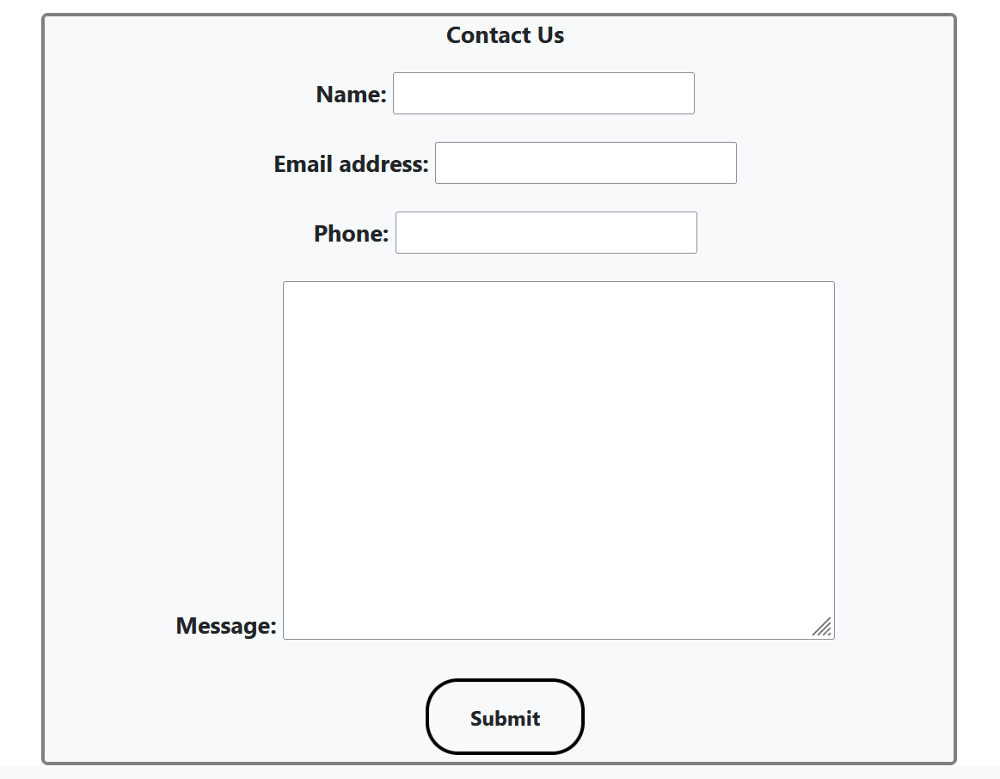

# Goals
## Visitor goals
Target Audience are all the people who love chocolate. Business has a great potential to grow into B2B, especially for businesses where chocolate is necessity and main ingredient is chocolate, like bakeries and coffee shops who will be able to purchase high quality products.

- To have easy navigation and clear message.
- To see the insight of the Company and understand quality of the product.
- For the page to be relevant to what the visitor searched online.
- For the product to be of a good quality, as presented.
- To be able to make purchase easy and quickly.
- To be able to see Social Media links for further Information and stories about the Company.

## User Goals

User Goals can be found within the Kanban board as part of User Stories where users goals are mentioned.

## Future implementation

Future implementations are : 
- Adding more style to forms.
- Adding more colors and more products to the shop.
- Dividing shop to more apps like basket and checkout app.
- Perfecting media queries for easy multi device use.

# Design Choices
## Font choices

I have decided to use [Google Fonts](https://fonts.google.com/). 
 - Font Style used: Manrope 300.
 - This font complements Art Of Chocolate WebShop really well.
 - I have included example of the style below: 
  
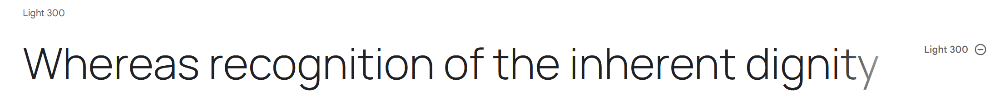

## Icons

- Social Media Icons [Facebook](https://www.facebook.com/), [Instagram](https://www.instagram.com/) and [Pinterest](https://www.pinterest.ie/).
- [Fontawesome](https://fontawesome.com/) was used to add social media icons and basket.

- Basket Icon

- Arrow images used as icons to add or remove products from the basket. Also, basket shows number of items added to the basket on the top right side of the header in the basket Url.

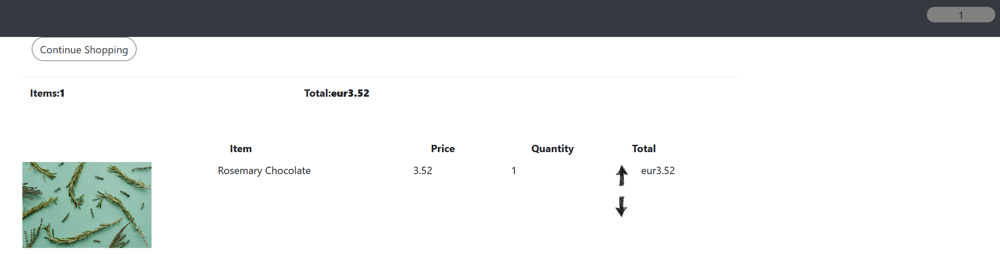

 
## Color scheme and styling

- [Coolors](https://coolors.co/) was used to generate Colors used for this project. As product images are colorful subtle colors were used to not distract user while browsing the shop.

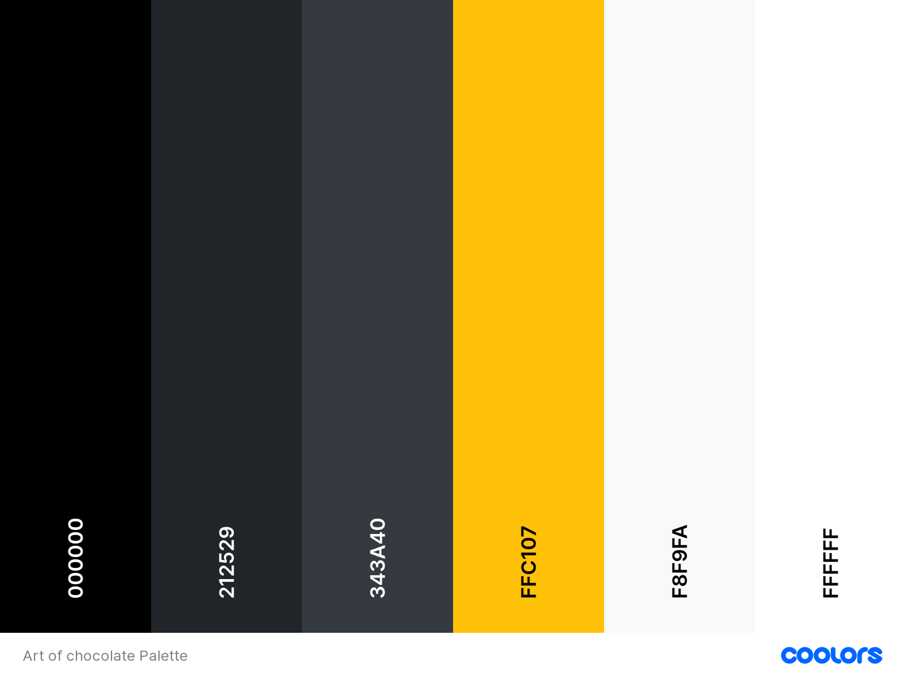

# Wireframes
All wireframes are created with [Balsamiq](https://balsamiq.com/) during the Scope Plane part of the design and planning process for this project.

Main Page

Chocolate Shop

Basket

Register Page

Sign In

Sign Out

Success

Contact Us

# ERD Diagram
ERD Diagram is created with [Lucidchart](https://www.lucidchart.com/pages/) during the Scope Plane part of the design and planning process for this project.

# Marketing Strategy
7 P's Marketing Strategy was used throughout the whole process of this project : 

- Product - Chocolate used is made from the finest cocoa solids and cocoa butter and as such will be marked as a "pure ingredients and high quality product".
- Promotion - Lot of promotions will be organised through Newsletters, Social Media, online events and other.
- Price - Price of all products is the same but the Company will make new strategies and planning for Newsletter and Social Media Campaigns. There will always be discounts available so we can engage more people to buy the product.
- Place - As a startup Company we will wait for few months before deciding on the best place to show off our product.
- People - People in our team will grow how the team grows, making sure customers are happy and that they are starting to promote the product free by "word of mouth".
- Process - All processes and materials used are sustainable and this will be presented to the customer.
- Physical Evidence - Company owns a factory where all chocolates are produced but main point of sale will be our Website.

Part of a Business Strategy is also a [Facebook](https://www.facebook.com/) mockup page, made with [Balsamiq](https://balsamiq.com/):

# SEO
## Keyword Research
Short-tail and long-tail words used for SEO implementation.

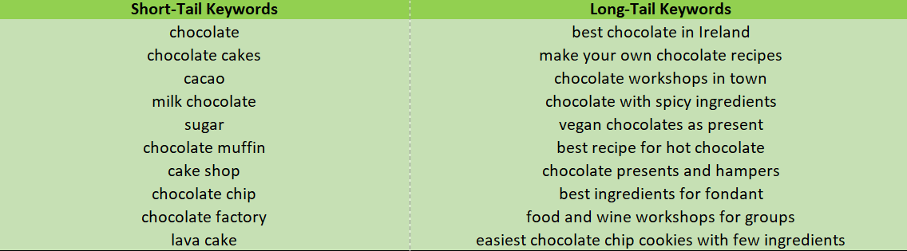

Further keywords research done :

[Wordtracker](https://www.wordtracker.com/) word chocolate within Ireland

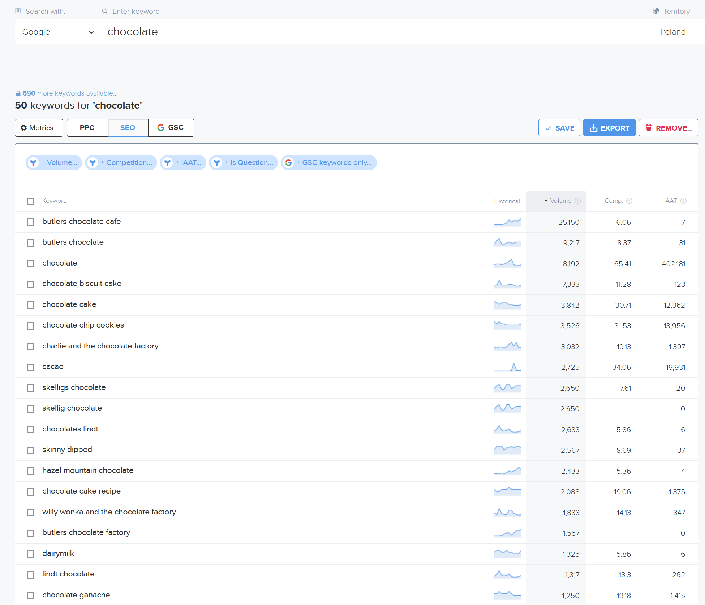

[Google](https://www.google.com/) - Search for wordkey "chocolate"

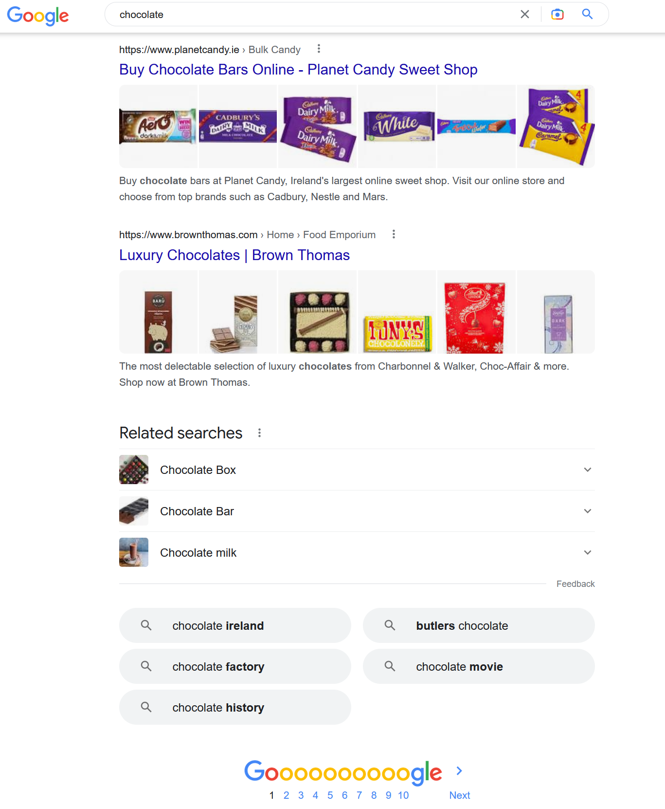

## Sitemap and robots.txt

 was used to create sitemap.txt file so that search engines can navigate through the site easily.

Robots.txt file was created to improve SEO by not allowing search engines to access particular parts of the website.

## Mailchimp

To increase audience and to send news, offers and discounts, Mailchimp form was implemented so users can signup for Newsletter. 

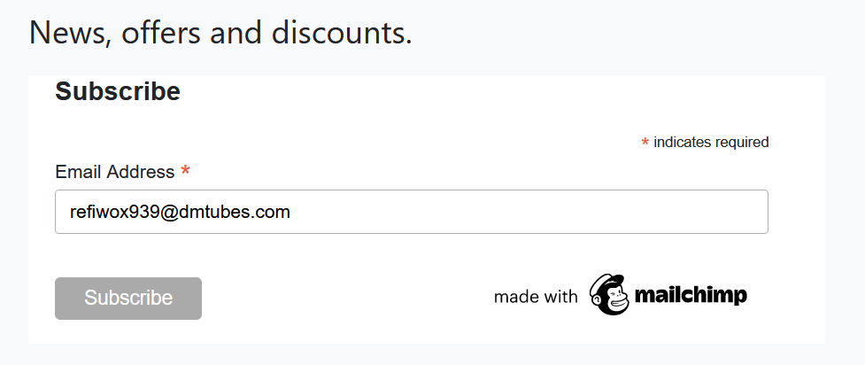

Message will show when user is successfully signed up.

Audience - E-mail Address has been added to the audience list.

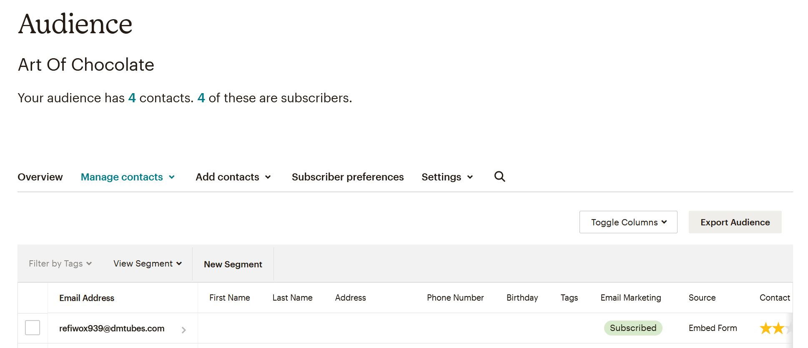

Embedded form can be generated through Mailchimp by going to Audience/Signup forms/Embedded forms

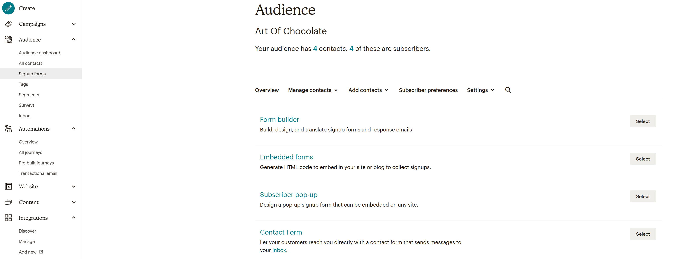

# Testings
To view all testing documentation, please refer to [TESTING.md](TESTING.md)

# Local Deployment
[Github](https://github.com/) was used to securely store the code online, Git for version control and online cloud IDE [Gitpod](https://www.gitpod.io/) for development.

In order to make a local copy of this repository, you can type the following into your IDE Terminal:

- `git clone https://github.com/Ivana505/art-of-chocolate.git` 

Alternatively, if using Gitpod, you can click below to create your own workspace using this repository.

The site was deployed to [Heroku](https://art-of-chocolate.herokuapp.com/) pages using following steps: 
   - Sign up or Login to Heroku 
   - Click on the "NEW APPLICATION" and create an App name and choose your region
   - Click on "Deploy" and choose your deployment method
   - If you are connecting with Github choose your main branch and find your repository
   - Add config vars PORT = 8000 and buildpacks python and nodejs
   - Click on deploy manually or automatically
   - The project has now been deployed
   - When deployed click on view
   - If you click on settings on the main menu bar you will find your Heroku git URL
   - Attach Postgres database by going to Resources, add-ons and type Postgres

Prepare your environment and settings.py, also create env.py file in the main directory where all your secret keys will "live".

To install the required packages for this application, type the following: pip3 install -r requirements.txt.

Create "Procfile" in the main directory web: gunicorn project-name.wsgi

Config vars required for this project are:

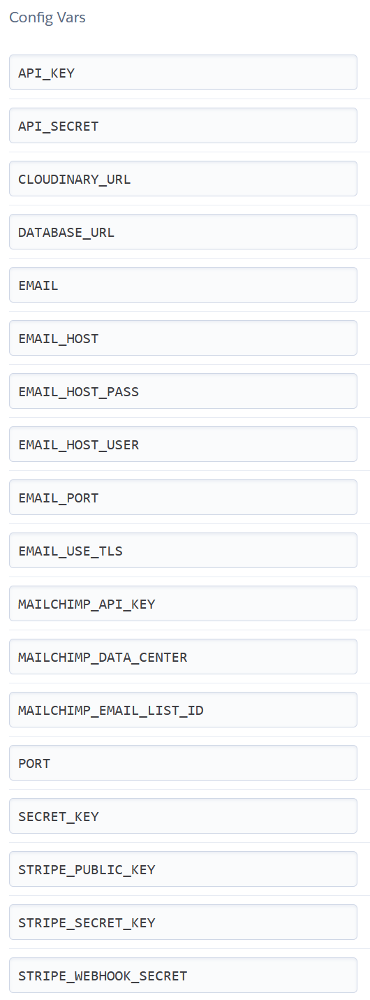

The live site can be previewed [here](https://art-of-chocolate.herokuapp.com/).

  # Languages and technologies used
- [Python](https://www.python.org/) - used for core programming language and logic.
- [Github](https://github.com/) - used for securely storing the code online.
- [Git](https://git-scm.com/) - used for version control.
- [Gitpod](https://www.gitpod.io/) - used for online cloud IDE and development.
- [Heroku](https://heroku.com/) - platform used to deploy the site to cloud online.
- [Django Secret Key Generator](https://miniwebtool.com/django-secret-key-generator/) - for generating Secret Key.
- [Font Awesome](https://fontawesome.com/) - for Icons on the page.
- [Freeformatter](https://www.freeformatter.com/) - used to format and beautify HTML and CSS code.
- [Sitemaps](https://www.xml-sitemaps.com/) - to create sitemaps for SEO.
- [Cloudinary](https://cloudinary.com/) - to store images.
- [Am I reponsive](https://ui.dev/amiresponsive) - to create am I responsive image.
- [Coolors](https://coolors.co/) - to generate color set used for the project.
- [Mailchimp](https://mailchimp.com/?currency=EUR) - to store E-mail Addresses for Users who signed up for Newsletter.
- [Mailjet](https://www.mailjet.com/) - to send order E-mail confirmations.

## Credits and Acknowledgements
  Image and Social Media sources:
 - [Pexels](https://www.pexels.com/photo/pile-of-chocolate-bar-1693027/) - Photo by Susanne Jutzeler, suju-foto
 - [Pexels](https://www.pexels.com/photo/herbs-on-teal-surface-5968221/) - Photo by Vanessa Loring
 - [Pexels](https://www.pexels.com/photo/close-up-photography-of-sliced-lemon-1002543/) - Photo by Lisa Fotios
 - [Pexels](https://www.pexels.com/photo/red-chili-pepper-858090/) - Jessica Lewis Creative
 - [Pexels](https://www.pexels.com/photo/cotton-lamb-artwork-1420706/) - Lukas
 - [Pexels](https://www.pexels.com/photo/yellow-donkey-rod-toy-1329314/) - Magda Ehlers
 - [Pexels](https://www.pexels.com/photo/white-and-black-cow-figurine-1340373/) - Magda Ehlers
 - [Pexels](https://www.pexels.com/photo/popcorn-serving-in-white-ceramic-bowl-1764338/) - Felipe Cardoso
 - [Pexels](https://www.pexels.com/photo/photo-of-matcha-powder-on-a-spoon-8004565/) - Darina Belonogova
 - [Pexels](https://www.pexels.com/photo/close-up-photography-of-honey-714522/) - Three-shots
 - [Pexels](https://pixabay.com/illustrations/arrow-handwork-left-right-turn-2079328/) - Arrows up and down pixabay, Gerd Altmann   

 - [YouTube channel CodingEx](https://www.youtube.com/watch?v=HsDSXh26yKc) - Helped me with creating chocolate_image.html page.
 - [YouTube channel Dennis Ivy Django Ecommerce series](https://www.youtube.com/watch?v=_ELCMngbM0E) - Used as a boilerplate for the project.
 - [Youtube channel Easy WebCode](https://www.youtube.com/watch?v=g55EQkDGdg4) - Details in creating Newsletter.
 - [Youtube channel Codepiep](https://www.youtube.com/watch?v=66joNBEyNwE) - Used to set up STRIPE.
 - [Youtube channel Technology IT](https://www.youtube.com/watch?v=dpU3KY6mQ28) - Used for adding categories to Django.
 - [Youtube channel Codemy.com](https://www.youtube.com/watch?v=_ph8GF84fX4) - Used for adding categories to Django.
 - [Youtube channel Cryce Truly](https://www.youtube.com/watch?v=3SKjPppM_DU) - Used for implementing 404 error page.
 - [Youtube channel Code Varto](https://www.youtube.com/watch?v=g_5ZDrl2KKE) - used for restricting letters in the phone input tag.

  Other sources
 - [Smartinsights](https://www.smartinsights.com/marketing-planning/marketing-models/how-to-use-the-7ps-marketing-mix/) - Insight of 7 P's in Marketing.
 - [Emarsys](https://emarsys.com/learn/blog/what-is-b2c-marketing/) - More Information about B2C.
 - [Assemblo](https://assemblo.com/guides/what-are-the-7-ps-of-marketing/)- Insight of 7 P's in Marketing.
 - [Stack Overflow](https://stackoverflow.com/questions/64476542/stripe-error-in-order-to-use-checkout-you-must-set-an-account-or-business-name) - Helped to resolve STRIPE checkout error.
 - [Django Central](https://djangocentral.com/django-admin-making-model-fields-required/) - For resolving the issue where Django categories showed as objects rather than with their names.
 - [Computerhope.com](https://www.computerhope.com/issues/ch000317.htm) - Used to create go back button.
 - [Pythonstacks](https://www.pythonstacks.com/blog/post/integrating-mailchimp-django/) - For implementing mailchimp.
 - [W3 Schools](https://www.w3schools.com/css/css3_buttons.asp) - For button styling.
 - [Web dev](https://web.dev/csp-xss/?utm_source=lighthouse&utm_medium=devtools) - To add CSP to files to increase Lighthouse best practices.

I want to say thank you to my Mentor Tim for the guidance, and special thanks to tutor support and Slack Commmunity.

## Content
 - Content was created intentionally for the purpose of this project and this Website. 
 
 
 <!-- *Click to go back to the [top](#art-of-chocolate).* -->

