# TESTING 

Return to the [README.md](README.md)

# Table of content:
- [Validator testing](#validator-testing)
- [Browser compatibility](#browser-compatibility)
- [Manual testing](#manual-testing)
- [Accessibility](#accessibility)
- [Bugs](#bugs)
  - [Solved bugs](#solved-bugs)
  - [Unsolved bugs](#unsolved-bugs)
- [STRIPE payment testing](#stripe-payment-testing)
- [Email verification testing when signing up](#email-verification-testing-when-signing-up)
- [Django Administration testing](#django-administration-testing)

## Validator testing

Python code problems were showing within the workspace.

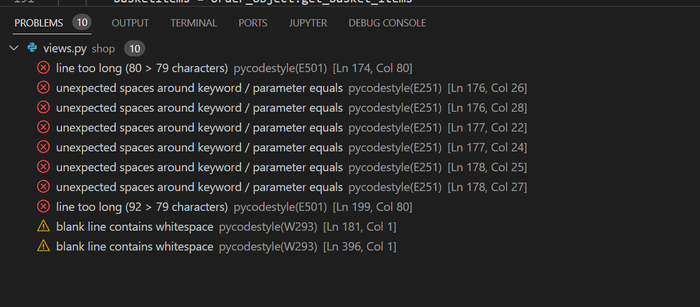

- All Python workspace problems have been corrected.

- After clearing all the from from the terminal, I have tested Python code with - [PEP8 validator](http://pep8online.com/) but as the Website was compromised I have validated code through gitpod as per Code Institute instructions.

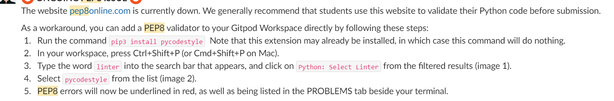

- No problems were detected.

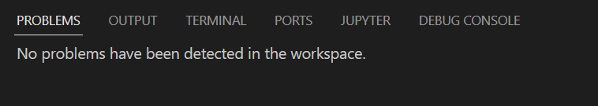

All HTML Urs were validated with :

[Landing page](https://validator.w3.org/nu/?doc=https://art-of-chocolate.herokuapp.com/)

[Category page](https://validator.w3.org/nu/?doc=https://art-of-chocolate.herokuapp.com/?category=dark_chocolate)

[Login](https://validator.w3.org/nu/?doc=https://art-of-chocolate.herokuapp.com/accounts/login/)

[Signup](https://validator.w3.org/nu/?doc=https://art-of-chocolate.herokuapp.com/accounts/signup/)

[Basket](https://validator.w3.org/nu/?doc=https://art-of-chocolate.herokuapp.com/basket/)

[Chocolate page](https://validator.w3.org/nu/?doc=https://art-of-chocolate.herokuapp.com/chocolate_page/35)

[Password reset](https://validator.w3.org/nu/?doc=https://art-of-chocolate.herokuapp.com/accounts/password/reset/)

[Checkout](https://validator.w3.org/nu/?doc=https://art-of-chocolate.herokuapp.com/checkout/)

[Contact us](https://validator.w3.org/nu/?doc=https://art-of-chocolate.herokuapp.com/contact/)

Some of the validation screenshots can be found below.

Main page validation
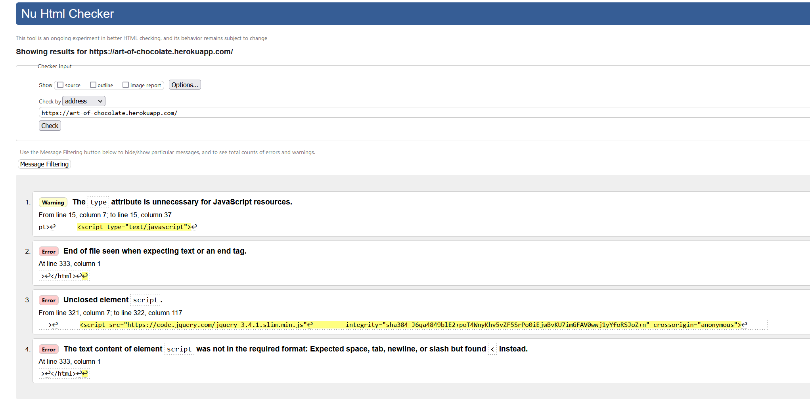

Checkout session error was showing below error but it was validated by Page source and also in the live booking process.
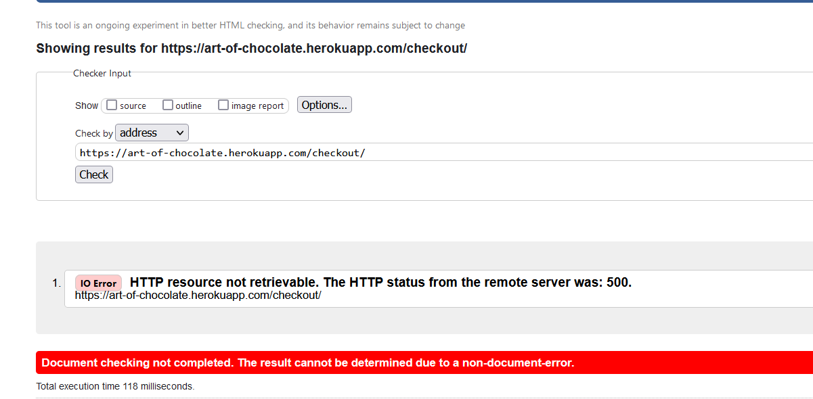

Checkout session validated in live booking process.

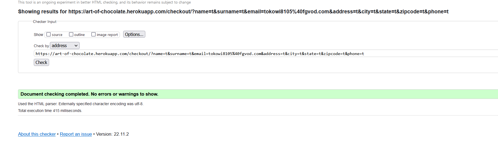

- Errors from all pages have been corrected.

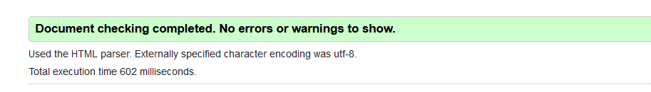

- CSS Validation was made with Jigsaw  and was showing no errors.

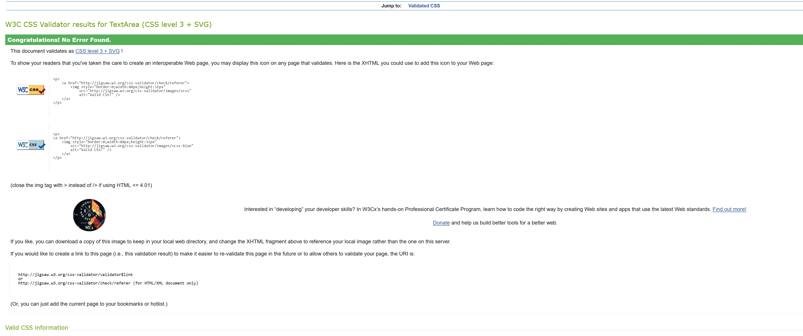

## Browser compatibility

Different browsers were used to validate the look and compatibility of the page.

Landing page [Google Chrome](https://www.google.com/chrome/?brand=YTUH&gclid=EAIaIQobChMIlsOG9sya-wIVcoBQBh3FIgOFEAAYASAAEgIHcfD_BwE&gclsrc=aw.ds)

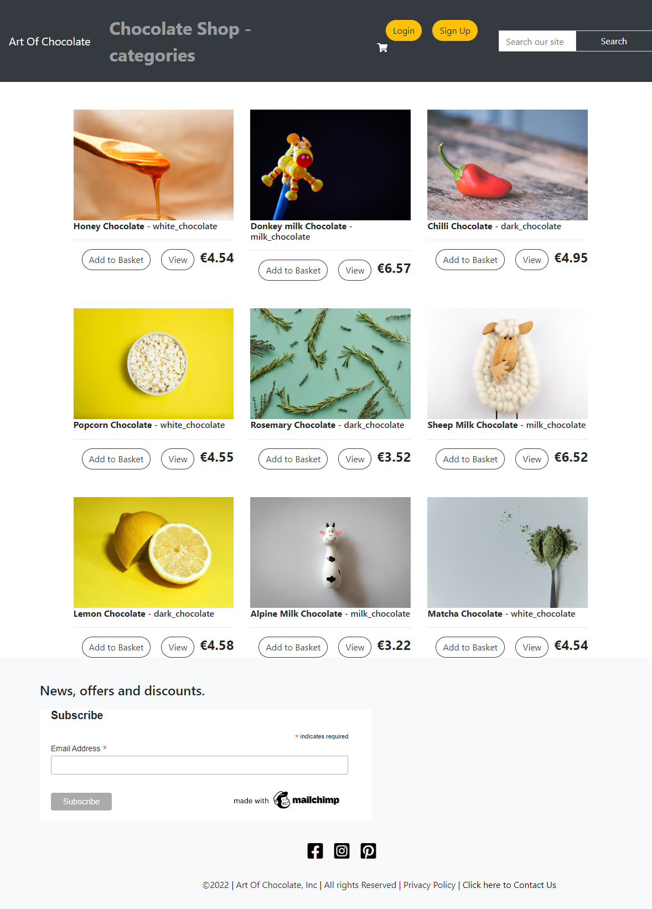

Chocolate page [MS Edge](https://www.microsoft.com/en-us/edge)

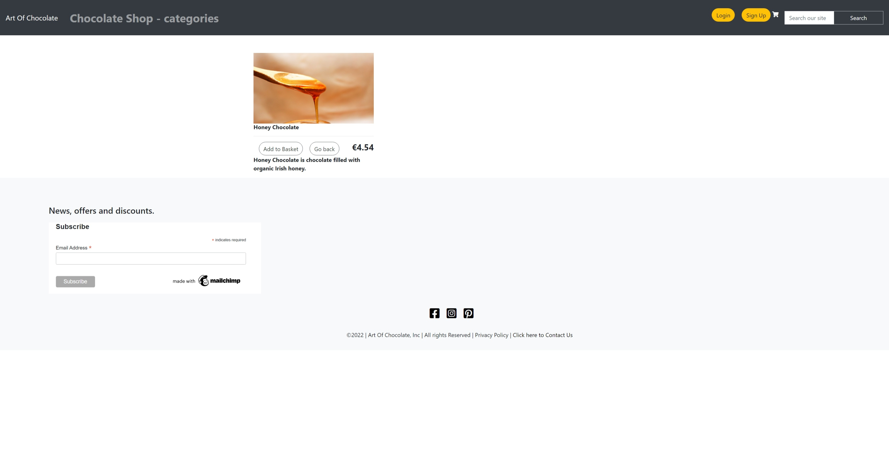

Contact Us page [Mozzilla Firefox](https://www.mozilla.org/en-US/firefox/new/)

## Manual testing

I have manually tested functionality of the Website:
 - Sign in with E-mail verification.
 - Adding products to basket as Anonymous and Registered User.
 - Stripe payment with mailjet confirmation E-mail.
 - Newsletter with Mailchimp and adding E-mails to Audience section.
 - Shipping form - not to let user to proceed without filling the form and adding numbers to phone number input field.
 - Contact Us form which is submitted to the terminal.
 - Buttons on all pages to make sure they are working (adding product, removing product, submitting forms).
 - Access and restrictions for specific users -  Anonymous, Registered and Superuser.
 - Using print to check Javascript code.

## Accessibility
I have confirmed that the Website is accessible by inspecting it in Lighthouse on the [Google Chrome](https://www.google.com/chrome/?brand=FKPE&gclid=EAIaIQobChMIqOPWwuu69AIVFeDtCh1CEgKGEAAYASAAEgKvwvD_BwE&gclsrc=aw.ds) Dev tools.
    
Result for desktop 
 - Performance for the desktop version 

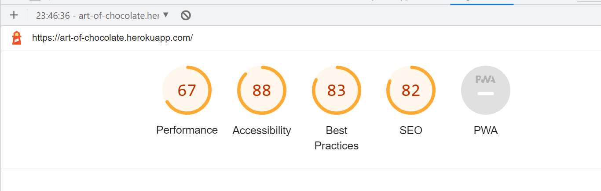

 - Increased parameters.

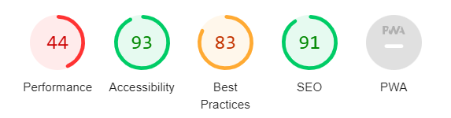

 - Future implementation to improve best practices : Resizing images.
 - I tried removing Javascript from base.html and CSP added as meta tag but result for Best Practices dicreased.
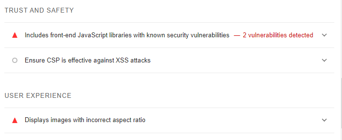

Result for mobile devices
- Performance for mobile devices 

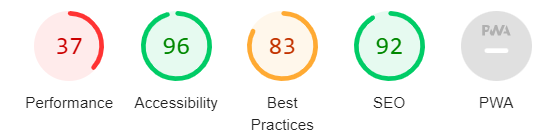

## Bugs

### Solved bugs
All problems from [Gitpod](https://www.gitpod.io/) have been resolved. Most of them were Python related, indentation bugs and lines of code too long.

- Attribute error - resolved by removing shop app name from the apps list.

- Not Found error - resolved by adding correct path to urls.py file.

- ProgrammingError at - Models were updated but migration was not done. Resolved by making migrations and migrating new model added.

- IndentationError - Migration was not processing due to incorrect indentationt, indentation corrected to resolve the issue.

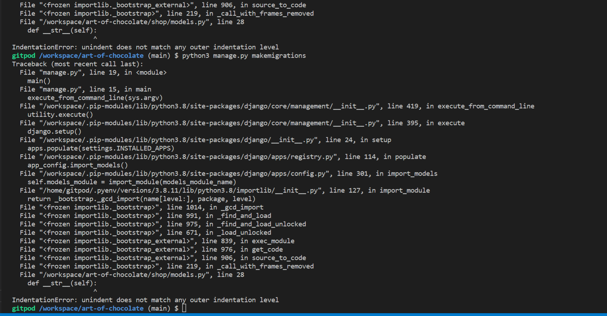

- SyntaxError - Due to misspelling error migration was not possible, entry corrected to resolve the issue.

- PermissionError - Error when tried to edit the product. Resolved with connecting and installing cloudinary correctly.

- NameError - Resolved by importing get_404 object to django.

- TamplateDoesNotExist - error resolved by moving html to correct template folder.

### Unsolved bugs
JSHint was showing two different warnings and one variable as unused.

 - I have added /* jshint esversion: 11, jquery: true */ to basket.js to ignore " ['quantity'] is better written in dot notation. " error.

 - restrictAlphabets variable is used within shipping form to restrict the user of inputting letters into the phone field.

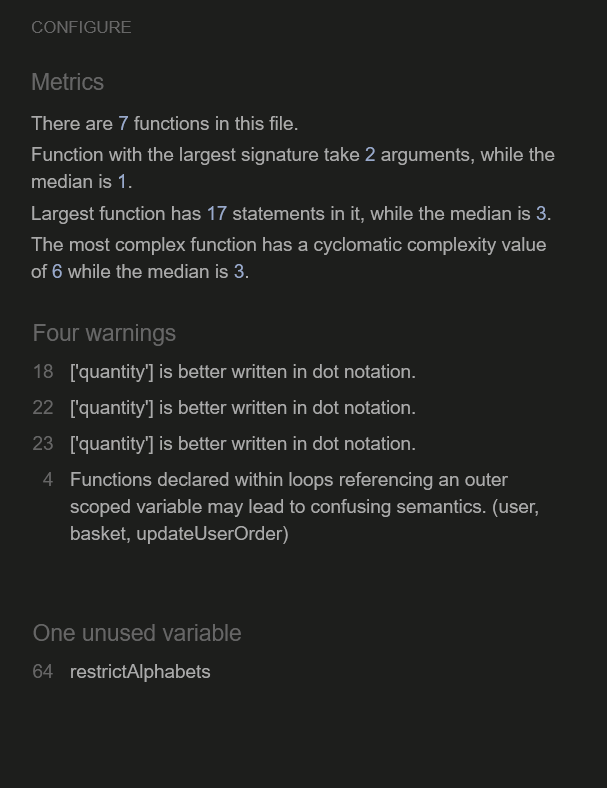

### STRIPE payment testing

- I have tested Stripe payment with card provided in Stripe documentation.

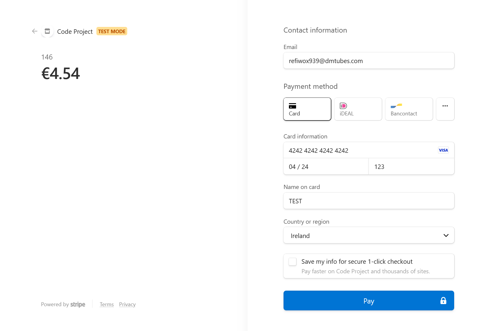

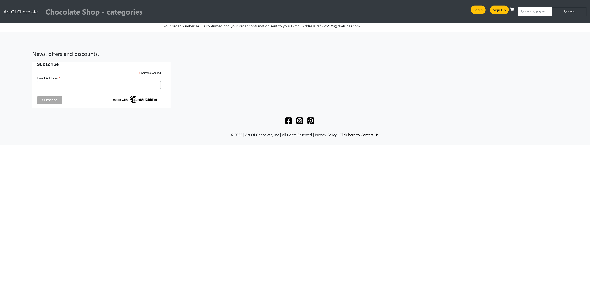

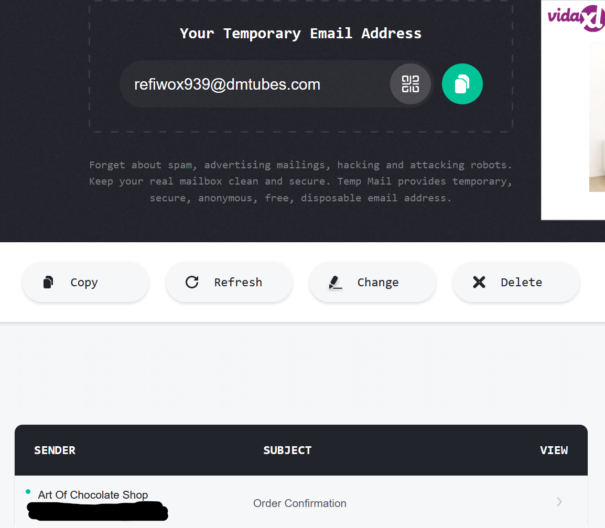

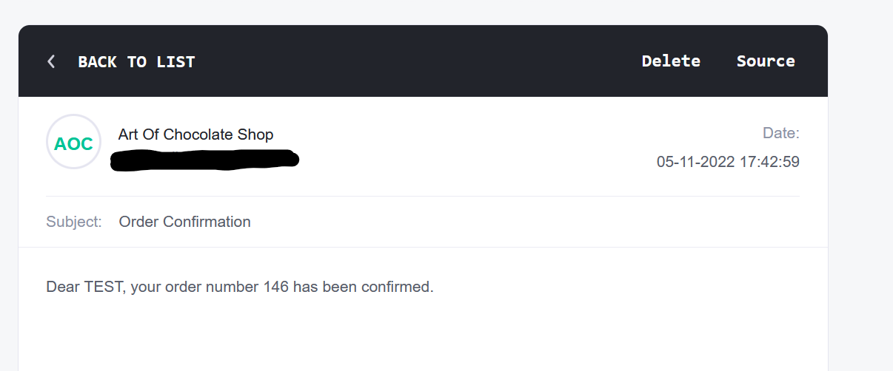

### Email verification testing when signing up

- Verification was tested both locally and through deployed website.

- Processing payment
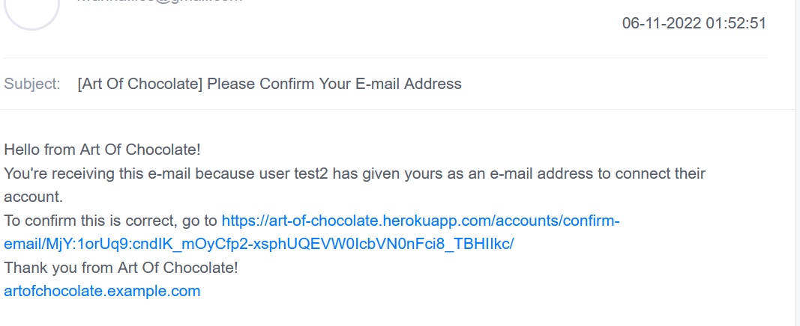

### Django Administration testing
- I have tested Django Administration and all is working as it should. All data is storing as intended.

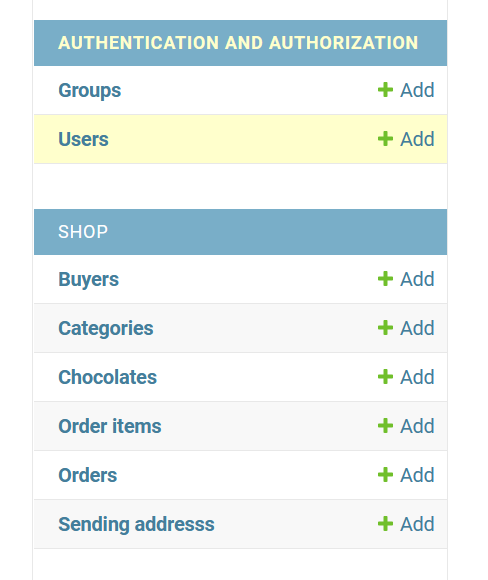
