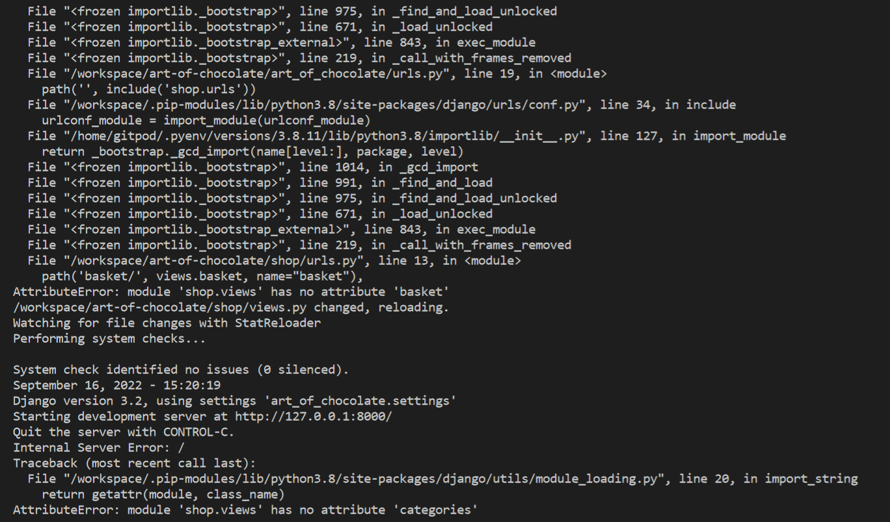
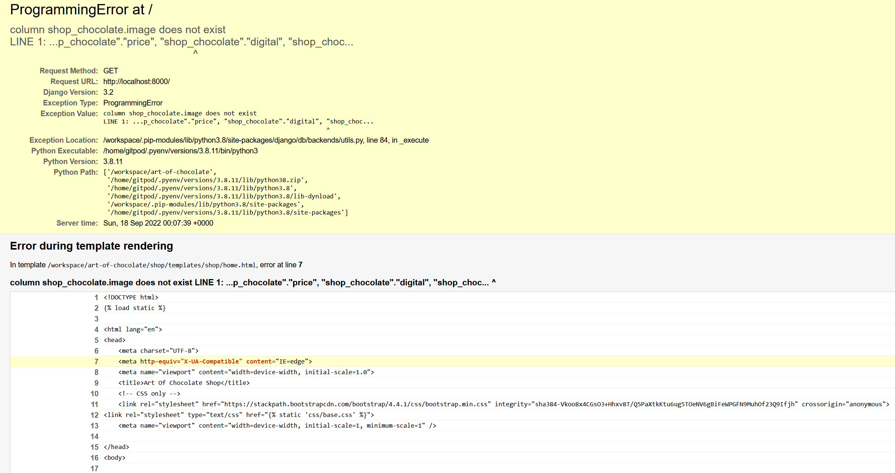
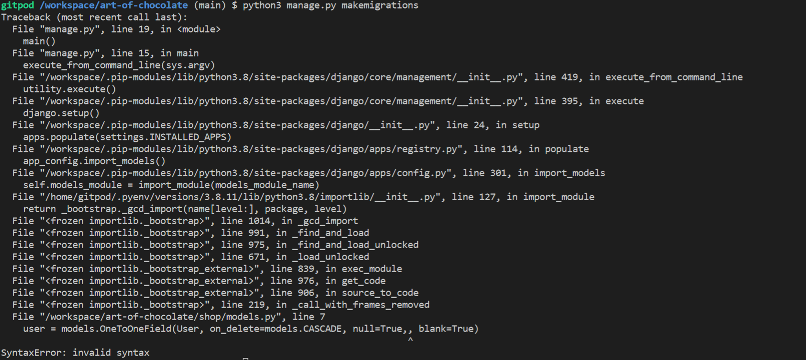
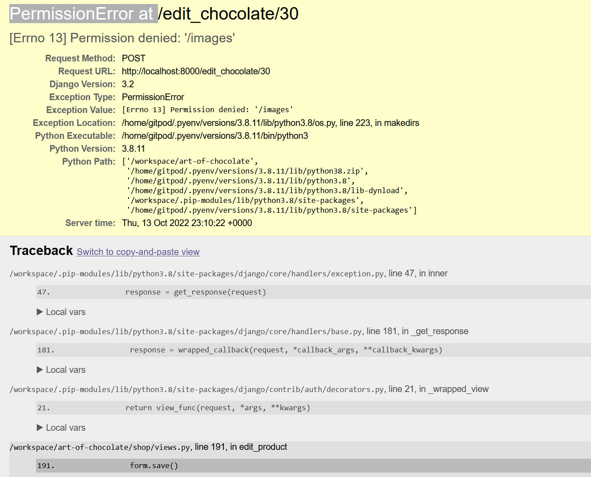
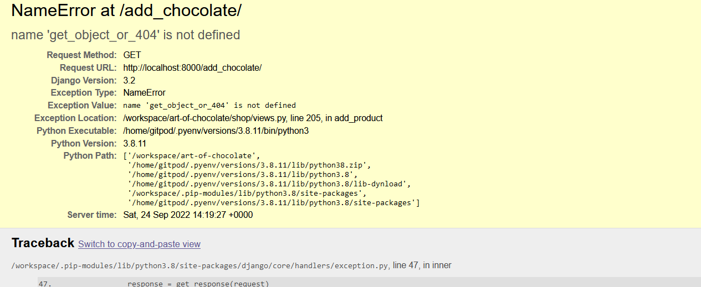
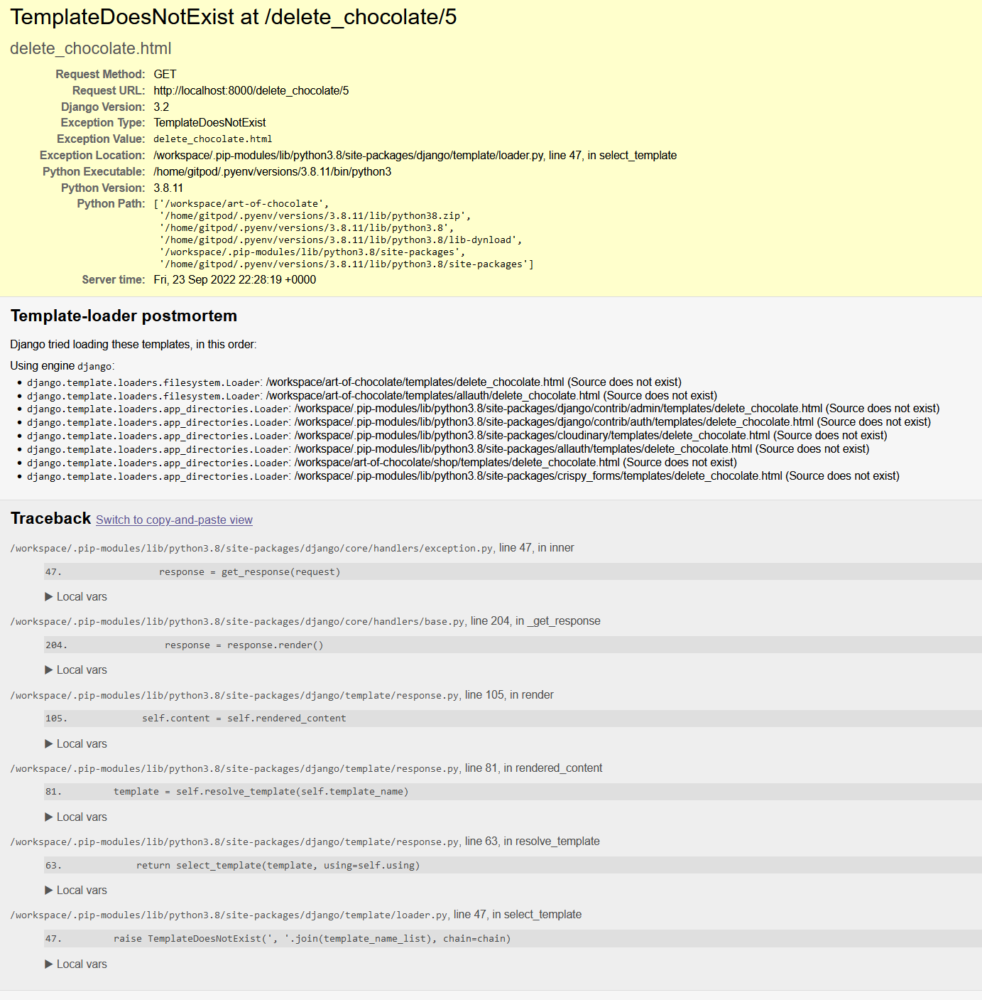
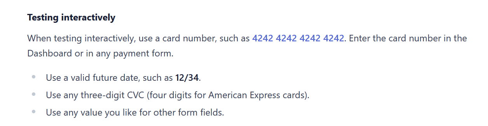
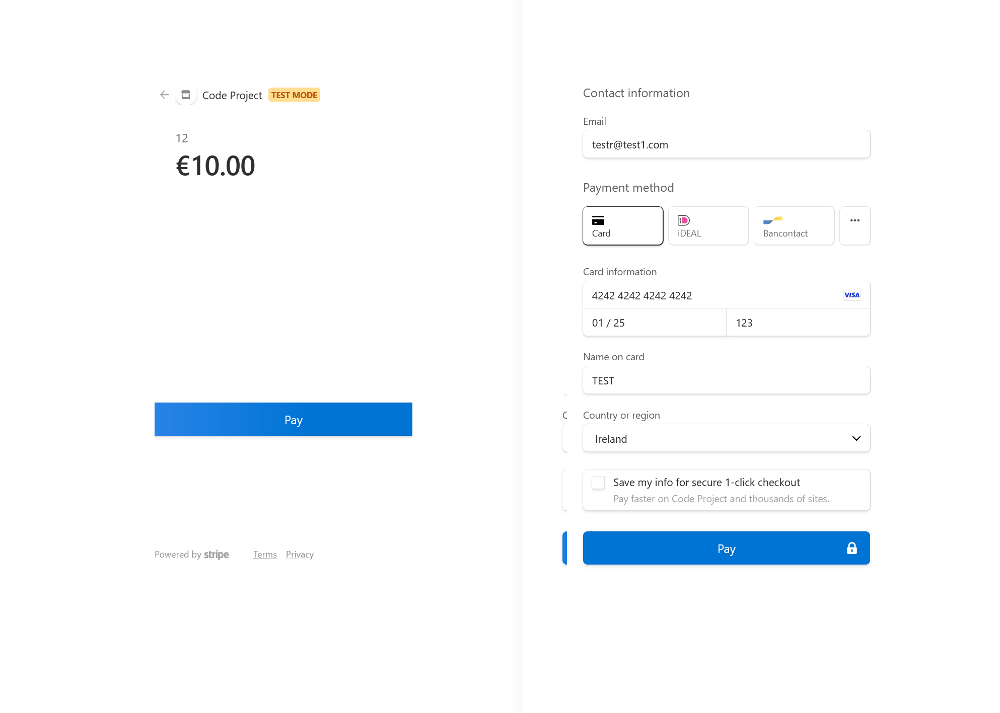

# TESTING 

Return to the [README.md](README.md)

## Validator testing and browser compatibility
- I have tested Python code with - [PEP8 validator](http://pep8online.com/), ...

- All errors have been corrected

- HTML Validation was made with 

- CSS Validation was made with Jigsaw 

## Accessibility
- I have confirmed that the Website is accessible by inspecting it in Lighthouse on the [Google Chrome](https://www.google.com/chrome/?brand=FKPE&gclid=EAIaIQobChMIqOPWwuu69AIVFeDtCh1CEgKGEAAYASAAEgKvwvD_BwE&gclsrc=aw.ds) Dev tools.
    
Result for desktop 
 - Performance for the desktop version 

Result for mobile devices
- Performance for mobile devices 

## Bugs

### Solved
- All problems from [Gitpod](https://www.gitpod.io/) from the image have been resolved. Most of them were indentation bugs and lines of code too long.

![solved bugs]

- Attribute error - resolved by removing shop app name from the apps list.

- Not Found error - resolved by adding correct path to urls.py file.

- ProgrammingError at - Models were updated but migration was not done. Resolved by making migrations and migrating new models added.

- IndentationError - Migration was not processing due to incorrect indentationt, indentation corrected to resolve the issue.

- SyntaxError - Due to misspelling error migration was not possible, entry corrected to resolve the issue.

- PermissionError - Error when tried to edit the product. Resolved with connecting and installing cloudinary correctly.

- NameError - Resolved by importing get_404 object to django.

- TamplateDoesNotExist - error resolved by moving html to correct template folder.

### STRIPE payment testing

- I have tested Stripe payment with card provided in Stripe documents.

### Unsolved bugs
- Unsolved problem which relates to ms-toolsai.jupyter extension not bein synched and not added in .gitpod.yml. I have checked Slack community and this is known issue which we can ignore.
- This is also part of the repository cloned for the project that should not be touched.

### Django Administration testing
- I have tested Django Administration,

